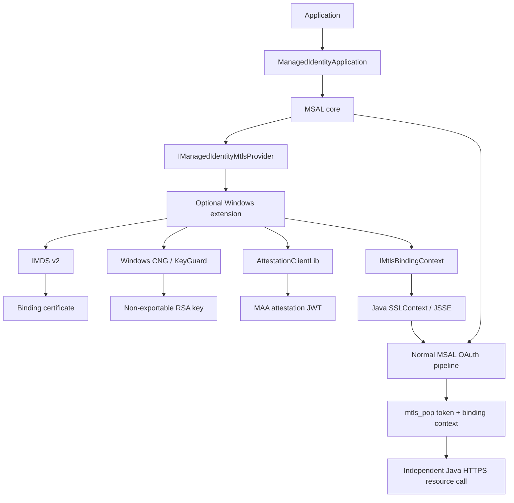
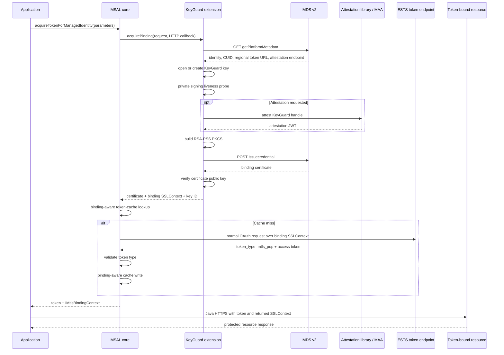
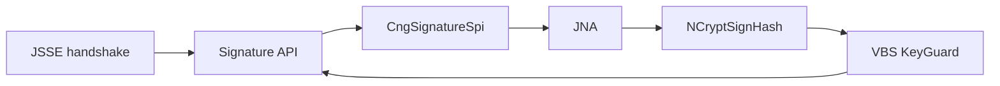
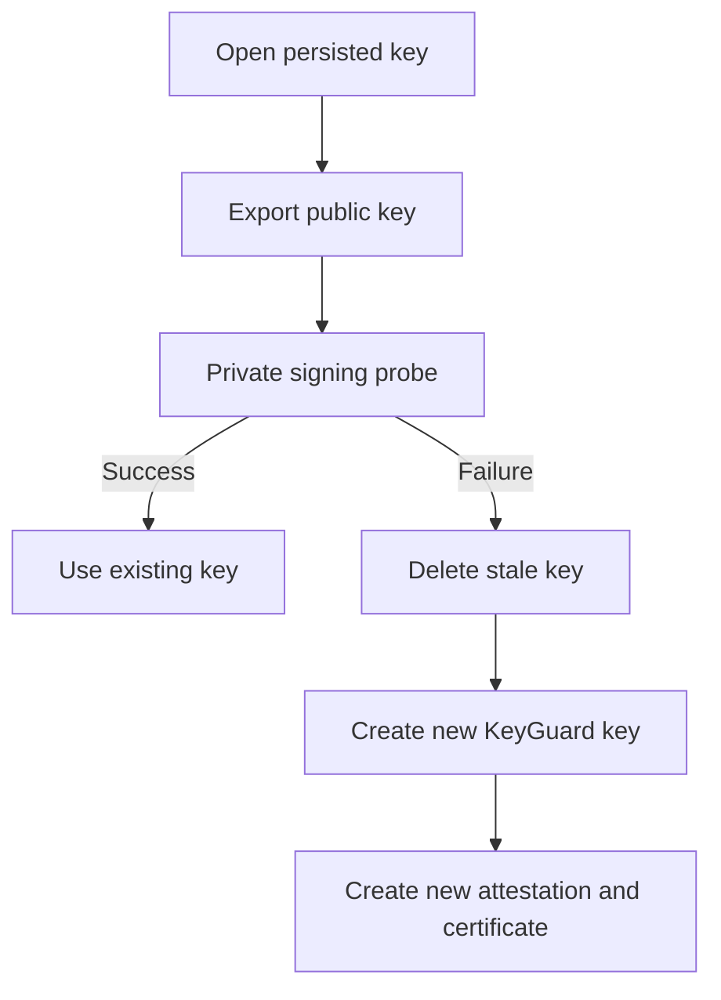

# Reviewer guide: Managed Identity v2 KeyGuard mTLS PoP

This guide is the recommended entry point for reviewing the Managed Identity v2
mTLS Proof-of-Possession change. It explains the intended architecture, security
boundaries, protocol flow, review order, test coverage, and manual validation.

For a feature-by-feature comparison with current MSAL.NET, including intentional
platform differences and the remaining release gaps, see
[`managed-identity-v2-dotnet-java-parity-gap-analysis.md`](managed-identity-v2-dotnet-java-parity-gap-analysis.md).

The implementation is intentionally split between the portable MSAL core and an
optional Windows extension. Reviewers should verify that this separation remains
intact: native code performs only platform cryptographic operations, while Java
continues to own OAuth, HTTP, caching, certificate parsing, and TLS.

## Review goals

The change is successful only if all of the following remain true:

- The KeyGuard private key is never exported into Java memory.
- Java JSSE performs both token-endpoint and downstream TLS.
- Native interop is limited to Windows CNG/KeyGuard and attestation operations.
- Attestation is optional, but fails closed whenever it is requested.
- Tokens are cached only with the exact certificate binding that produced them.
- A normal bearer token cannot satisfy an mTLS PoP request.
- A token bound to certificate A cannot be used with certificate B.
- Application developers receive a reusable standard Java `SSLContext`.
- The standard MSAL OAuth pipeline remains responsible for token requests.
- Custom HTTP clients cannot silently discard the mTLS configuration.
- Credential-bound HTTP requests cannot follow redirects.
- The optional native extension does not affect applications that do not use it.
- Java 8 source and bytecode compatibility are preserved.

## Recommended review order

Reviewing the files in this order minimizes context switching:

1. Public API and result surface.
2. Managed Identity request orchestration.
3. OAuth and HTTP integration.
4. Token-cache partitioning.
5. Optional provider loading.
6. KeyGuard and signing bridge.
7. Certificate and binding lifecycle.
8. Attestation and IMDS v2.
9. Native packaging.
10. Unit tests and the manual E2E.

## Architecture summary



### Ownership boundary

| Component | Owns | Must not own |
| --- | --- | --- |
| MSAL core | OAuth, claims, capabilities, retries, telemetry, response parsing, token cache | KeyGuard handles, CSR construction, attestation implementation |
| Windows extension | CNG key operations, attestation, CSR, binding certificate lifecycle | Bespoke OAuth token client, persistent token cache |
| JCA/JSSE bridge | TLS signatures through `PrivateKey` and `SignatureSpi` | Private-key export |
| Application | Independent downstream HTTP call through returned `SSLContext` | Native key-handle management |

## End-to-end protocol flow



## Public API review

### Parameter combinations

The intended combinations are:

```java
ManagedIdentityParameters.builder(resource)
        .withMtlsProofOfPossession()
        .build();
```

```java
ManagedIdentityParameters.ManagedIdentityParametersBuilder builder =
        ManagedIdentityParameters.builder(resource)
                .withMtlsProofOfPossession();

ManagedIdentityParameters parameters =
        ManagedIdentityAttestationExtensions
                .withAttestationSupport(builder)
                .build();
```

The following must be rejected:

```java
ManagedIdentityAttestationExtensions
        .withAttestationSupport(
                ManagedIdentityParameters.builder(resource))
        .build();
```

Attestation is a strengthening option for an mTLS binding. It is not a
standalone token-acquisition mode.

### Result surface

An mTLS result exposes:

- `tokenType()`, which must be exactly `mtls_pop`;
- `bindingCertificate()`, the public leaf certificate;
- `mtlsBindingContext()`, a process-local reusable binding context;
- `mtlsBindingContext().sslContext()`, the standard JSSE context;
- `mtlsBindingContext().keyId()`, the full-certificate binding identity.

The binding context is intentionally not serializable. Native handles and
`SSLContext` instances must be reconstructed by each process.

## Core request orchestration

Primary file:

`msal4j-sdk/src/main/java/com/microsoft/aad/msal4j/AcquireTokenByManagedIdentitySupplier.java`

Review these invariants:

- The extension is invoked only for mTLS PoP requests.
- Provider exceptions are normalized to MSAL exceptions.
- Existing MSAL exceptions retain their original error codes.
- IMDS calls use request-scoped IMDS retry behavior.
- The external ESTS request does not inherit IMDS retry behavior.
- The resolved binding cache key is stored on request-scoped state.
- Public `ManagedIdentityParameters` are not mutated during acquisition.
- Cache lookup and cache write use the same resolved extended cache hash.
- The final result preserves token metadata when the binding context is attached.

## OAuth pipeline integration

Primary files:

- `TokenRequestExecutor.java`
- `OAuthHttpRequest.java`
- `HttpRequest.java`
- `DefaultHttpClient.java`
- `TokenResponse.java`

The ESTS exchange must remain a specialization of the normal OAuth pipeline,
not a second token client.

Review that the request-specific endpoint and socket factory do not bypass:

- claims merging;
- client capabilities;
- telemetry headers;
- correlation IDs;
- retry and error parsing;
- token response deserialization;
- refresh metadata;
- cache writes.

The token response must explicitly contain `token_type=mtls_pop`. Missing or
different token types fail closed.

## HTTP security review

### Redirects

Any request carrying a request-specific client-certificate socket factory must
disable automatic redirects. A redirect could disclose proof-of-possession to
an unintended destination.

### HTTPS-only endpoint

The regional token endpoint returned by platform metadata must use HTTPS.
Reject non-HTTPS endpoints before sending OAuth parameters or presenting the
binding certificate.

### Custom HTTP clients

MSAL Java supports application-provided `IHttpClient` implementations. Existing
implementations predate request-specific socket factories.

The `IMtlsCapableHttpClient` marker is an explicit compatibility contract:

- the client understands `HttpRequest.sslSocketFactory()`;
- the client applies that factory to the exact request;
- the client preserves no-redirect behavior;
- a custom client lacking the capability fails fast.

Silent fallback to a non-mTLS request is a security failure.

## Binding-aware token cache

An mTLS token is reusable only with the certificate to which it was issued.

The extended cache identity includes:

| Dimension | Value |
| --- | --- |
| Token type | `mtls_pop` |
| Binding identity | Base64UrlNoPadding(SHA-256(full leaf certificate DER)) |
| Attestation mode | Attested and unattested requests are isolated |
| Existing MSAL dimensions | Authority, tenant, client, scopes/resource, claims, account, flow |

Review these cases:

- bearer cache entries cannot satisfy mTLS requests;
- certificate A cannot satisfy certificate B;
- same-key certificate renewal changes the cache partition;
- attested and unattested bindings never cross-hit;
- force refresh bypasses the access-token cache;
- cache hits still return a live binding context.

## KeyGuard private-key bridge



### `CngRsaPrivateKey`

Review that:

- `getEncoded()` returns `null`;
- `getFormat()` returns `null`;
- private exponent access is unavailable;
- only public modulus and exponent are represented in Java;
- native handle cleanup is idempotent;
- accidental Java serialization cannot expose private key material.

### `CngSignatureSpi`

Review that:

- supported hashes are explicit;
- unsupported algorithms fail rather than defaulting;
- PSS parameters are validated;
- MGF must be MGF1;
- digest and MGF digest must match;
- salt lengths must be supported;
- trailer field must be one;
- non-KeyGuard keys delegate to another provider;
- provider delegation cannot recurse into `CngProvider`;
- signatures are produced only through `NCryptSignHash`.

### `CngX509ExtendedKeyManager`

Review socket and engine paths:

- `chooseClientAlias`;
- `chooseEngineClientAlias`;
- certificate chain lookup;
- private key lookup;
- RSA key-type filtering.

Both `SSLSocket` and `SSLEngine` consumers must be supported.

## Key lifecycle

### Per-boot stale keys

KeyGuard KSP metadata can survive a reboot even when the VBS-protected private
material is no longer usable.

Opening the key and exporting its public key is not a sufficient liveness test.
The extension performs a private signing probe after reopening an existing key.



Review that stale-key recovery:

- deletes the unusable key;
- recreates it before CSR generation;
- does not reuse attestation evidence for old key material;
- closes failed native handles;
- fails closed if recreation is unsuccessful.

### Certificate rotation

Review that:

- certificates rotate before expiry;
- the current generation remains available during safe handoff;
- old generations are retained only while needed;
- expired retired generations close native handles;
- normal cache hits still perform retired-generation cleanup;
- rotation changes the token-cache binding partition.

## Attestation

Attestation is requested only when the optional extension's
`ManagedIdentityAttestationExtensions.withAttestationSupport(builder)` is used.

When selected:

- missing DLL loading fails;
- empty attestation output fails;
- malformed JWTs fail;
- expired evidence fails;
- stale evidence inside the freshness buffer is not reused;
- failures never downgrade to unattested issuance.

### Attestation cache

The cache identity is:

```text
normalized attestation endpoint + fingerprint of current public key material
```

Review:

- normalized endpoint handling;
- five-minute freshness buffer;
- successful-result-only caching;
- no caching of failures;
- per-key single-flight synchronization;
- no coalescing between distinct keys.

## IMDS v2 review

Primary file:

`msal4j-mtls-extensions/src/main/java/com/microsoft/aad/msal4j/mtls/ImdsV2Client.java`

Protocol values:

| Area | Value |
| --- | --- |
| API query | `cred-api-version=2.0` |
| Metadata path | `/metadata/identity/getplatformmetadata` |
| Credential path | `/metadata/identity/issuecredential` |
| Identity types | `SystemAssigned`, `UserAssigned` |
| CUID CSR OID | `1.3.6.1.4.1.311.90.2.10` |
| CSR signature | RSA-PSS SHA-256 |

Review that:

- requests include the IMDS metadata header;
- metadata response includes the expected IMDS server marker;
- identity selection matches the requested managed identity;
- required fields are validated before use;
- optional attestation is omitted when not requested;
- missing attestation fails only when attestation was requested;
- certificate response is validated before constructing the binding context.

## CSR review

Primary file:

`msal4j-mtls-extensions/src/main/java/com/microsoft/aad/msal4j/mtls/Pkcs10Builder.java`

Review:

- DER encoding, not text concatenation;
- subject and public-key encoding;
- CUID attribute OID;
- UTF-8 JSON attribute value;
- RSA-PSS SHA-256 signature;
- correct MGF1 parameters;
- salt length;
- signature BIT STRING encoding;
- CSR uses the current KeyGuard key.

## Native DLL packaging

The optional extension bundles the x64 native DLL from:

```text
Microsoft.Azure.Security.KeyGuardAttestation 1.1.5
```

This matches the version pinned by current MSAL.NET.

The DLL is stored at:

```text
META-INF/native/win-x64/AttestationClientLib.dll
```

Expected SHA-256:

```text
90dfcce20e1a74519b49796eeee17e6e59a257c3acf754f454a49380d28a568b
```

Review:

- resource exists in the production extension JAR;
- resource also survives E2E shading;
- runtime extraction uses a unique temporary directory;
- extracted bytes are verified before loading;
- architecture mismatch fails clearly;
- manual `PATH` or `java.library.path` configuration is unnecessary;
- package license and notice are included;
- only the optional extension carries the native payload.

## Test inventory

### Core SDK

| Test area | Purpose |
| --- | --- |
| Parameter tests | Valid and invalid PoP/attestation combinations |
| Provider loader tests | Missing, unique, and ambiguous providers |
| Binding tests | Endpoint and certificate-binding validation |
| Result tests | Token type and transient binding context |
| HTTP tests | Socket factory application and redirect prevention |
| Token executor tests | Normal OAuth pipeline with request-specific TLS |
| Managed Identity supplier tests | Exception normalization and IMDS retry behavior |
| Cache tests | Binding-aware extended cache partitions |

### Windows extension

| Test area | Purpose |
| --- | --- |
| KeyGuard tests | Stale-key detection and recreation |
| Private-key tests | Non-exportability and cleanup |
| Provider tests | Signature registrations and delegation |
| Signature tests | PKCS#1 and PSS parameter validation |
| Key-manager tests | Socket and engine alias selection |
| CSR tests | DER structure and PSS signing |
| Attestation cache tests | Expiry, freshness, and single flight |
| IMDS tests | Contracts, optional attestation, origin validation |
| Binding-context tests | Full-DER key ID and configured SSL context |
| Provider lifecycle tests | Rotation and retired-generation cleanup |
| Native-loader tests | Version and packaged DLL hash |

## Build commands

From the repository root:

```powershell
mvn -pl msal4j-mtls-extensions -am test
```

Build the profile-only E2E:

```powershell
mvn -pl msal4j-mtls-extensions-e2e -am `
    -Pe2e `
    -DskipTests `
    -Dmaven.javadoc.skip=true `
    package
```

The production extension JAR must not contain the E2E main class.

The shaded E2E artifact is:

```text
msal4j-mtls-extensions-e2e/target/*-e2e.jar
```

## Manual VM prerequisites

Use a disposable Windows x64 Trusted Launch Azure VM or VMSS instance with:

- Secure Boot;
- vTPM;
- VBS / Credential Guard;
- Managed Identity;
- Java 8 or later;
- network access to IMDS, attestation, ESTS, and the test resource.

For attestation, the TPM must report that it is capable of attestation.

Do not use production secrets for the manual test.

## Key Vault test configuration

Use a dedicated test vault and secret.

The VM managed identity needs only secret `get` permission.

For an access-policy vault:

```powershell
az keyvault set-policy `
    --resource-group <resource-group> `
    --name <vault-name> `
    --object-id <managed-identity-principal-id> `
    --secret-permissions get
```

The test vault must be configured for token-bound authentication. Apply service
configuration only to a dedicated vault because enforcement can reject ordinary
clients.

Example ARM body:

```json
{
  "properties": {
    "tokenBindingParameters": {
      "mode": "Enforced",
      "minimumTokenBindingStrength": "Unattested"
    }
  }
}
```

Reviewers should use the currently supported Key Vault ARM API version available
in their test environment.

## Run the E2E

Set:

```powershell
$env:MSAL_JAVA_MTLS_AKV_URL = "https://<vault-name>.vault.azure.net"
$env:MSAL_JAVA_MTLS_AKV_SECRET_NAME = "<secret-name>"
```

Optional identity selection:

```powershell
$env:MSAL_JAVA_MTLS_IDENTITY_CLIENT_ID = "<uami-client-id>"
```

Optional force refresh:

```powershell
$env:MSAL_JAVA_MTLS_FORCE_REFRESH = "true"
```

Optional second identity for token-A/binding-B rejection:

```powershell
$env:MSAL_JAVA_MTLS_MISMATCH_IDENTITY_CLIENT_ID = "<second-uami-client-id>"
```

Run:

```powershell
.\run-java-msi-v2-mtls-devapp.ps1
```

No standalone attestation DLL or native library path is required.

## Expected positive output

The app must confirm:

```text
PASS: token_type = mtls_pop
PASS: binding certificate returned
PASS: reusable JSSE binding context returned
PASS: cnf.x5t#S256 matches binding certificate
PASS: HTTP 200
PASS: AKV response validated
PASS: TokenSource = CACHE
PASS: matching binding context available
RESULT: PASS
```

## Expected negative output: no certificate

The app reuses the same valid `mtls_pop` token but creates a client connection
without the binding key manager.

Expected result:

```text
PASS: token without certificate rejected with HTTP 401 Unauthorized
```

This proves the resource is not accepting the token merely because it is
otherwise valid.

## Expected negative output: mismatched certificate

When a distinct second UAMI is configured:

```text
token A + binding A -> HTTP 200
token A + binding B -> rejected
```

The app verifies that the two key IDs differ before making the negative call.

## Live validation completed

The current implementation has been validated on a Windows Server 2025 Trusted
Launch Azure VM:

- the extension JAR loaded the bundled attestation DLL;
- no standalone DLL was placed beside the app;
- attestation completed;
- ESTS returned `mtls_pop`;
- token `cnf.x5t#S256` matched the full certificate DER hash;
- the returned Java `SSLContext` performed the downstream request;
- the test Key Vault returned HTTP 200 with the correct certificate;
- the same valid token without the certificate returned HTTP 401;
- the second acquisition returned `TokenSource.CACHE`.

Environment-specific subscription, tenant, identity, vault, and secret
identifiers are intentionally omitted.

## Troubleshooting

| Symptom | Likely cause | Check |
| --- | --- | --- |
| Extension provider not found | Extension JAR absent | Application dependencies and ServiceLoader resource |
| Multiple providers found | Duplicate extension implementations | Classpath |
| KeyGuard unavailable | VBS or Trusted Launch missing | Secure Boot, vTPM, VBS status |
| Stale key after reboot | Per-boot private material lost | Signing liveness probe and recreation logs |
| Attestation DLL load failure | Corrupt or wrong architecture resource | JAR resource, hash, Windows x64 |
| Attestation failure | TPM not provisioned | TPM attestation capability |
| IMDS metadata rejected | Missing IMDS response marker | Response headers and endpoint |
| Credential issuance rejected | CSR, CUID, identity, or attestation mismatch | IMDS response body and correlation ID |
| ESTS token type is not `mtls_pop` | Service not enrolled or request invalid | Token response and endpoint |
| `cnf` mismatch | Wrong certificate or cache partition | Full-DER key ID |
| Resource HTTP 401 without certificate | Expected negative result | Confirm positive call still returns 200 |
| Resource rejects correct certificate | Resource enrollment or identity permission | Resource configuration and access policy |
| Custom HTTP client failure | Client does not honor socket factory | `IMtlsCapableHttpClient` implementation |
| Unexpected redirect | Credential endpoint redirected | Redirect policy and configured endpoint |
| Second acquisition hits IDP | Cache identity changed or force refresh enabled | Token source and key ID |

## Threat-model checklist

### Private key

- [ ] No Java API exposes private key bytes.
- [ ] No export flags permit private-key export.
- [ ] Every TLS signature reaches `NCryptSignHash`.
- [ ] Handles are closed exactly once.
- [ ] Stale handles are deleted and recreated.

### Attestation

- [ ] Optional unless explicitly requested.
- [ ] Fail closed when requested.
- [ ] Cache is key-bound and endpoint-bound.
- [ ] Failures are not cached.
- [ ] Expiry and freshness buffer are enforced.

### Certificate

- [ ] Issued certificate public key matches KeyGuard key.
- [ ] Full DER determines binding identity.
- [ ] Rotation creates a new cache partition.
- [ ] Old native handles are retired and closed.

### OAuth

- [ ] Normal token pipeline is used.
- [ ] Claims and capabilities are preserved.
- [ ] Token endpoint is HTTPS.
- [ ] Token type is explicitly validated.
- [ ] Provider errors become MSAL errors.

### HTTP

- [ ] Request-specific socket factory is applied.
- [ ] Redirects are disabled.
- [ ] Custom clients fail fast without mTLS capability.
- [ ] Downstream calls can use standard Java clients.

### Cache

- [ ] Bearer and mTLS entries cannot cross-hit.
- [ ] Certificate A and B cannot cross-hit.
- [ ] Attested and unattested entries cannot cross-hit.
- [ ] Lookup and write use the same request-scoped key.

### Packaging

- [ ] Native DLL version is recorded.
- [ ] Native DLL hash is tested.
- [ ] License and notice are included.
- [ ] E2E code is absent from the production JAR.
- [ ] No manual DLL deployment is required.

## File-focused checklist

### Core API

- [ ] `ManagedIdentityParameters` validates option combinations.
- [ ] `IAuthenticationResult` exposes binding metadata without breaking old callers.
- [ ] `AuthenticationResult` preserves existing metadata.
- [ ] New interfaces are minimal and documented.

### Supplier

- [ ] Binding acquisition happens before mTLS cache lookup.
- [ ] Extended cache hash is immutable request state.
- [ ] IMDS and ESTS retry policies remain separated.
- [ ] Errors do not leak extension implementation types.

### HTTP stack

- [ ] Socket factory remains request-scoped.
- [ ] Default HTTP client applies it only to the intended request.
- [ ] No redirects occur for credential-bound traffic.

### Extension

- [ ] Provider lifecycle is concurrency-safe.
- [ ] Attestation cache is concurrency-safe.
- [ ] Native loader is concurrency-safe.
- [ ] Certificate rotation is concurrency-safe.
- [ ] Failure paths close handles.

### E2E

- [ ] Uses `IAuthenticationResult` and `IMtlsBindingContext`.
- [ ] Does not call an MSAL downstream-resource helper.
- [ ] Verifies `cnf.x5t#S256`.
- [ ] Requires exact HTTP 200 for the positive resource call.
- [ ] Requires HTTP 401 when no certificate is presented.
- [ ] Verifies cache reuse.
- [ ] Supports force refresh.
- [ ] Supports token-A/binding-B rejection with a second identity.

## Review completion criteria

The PR is ready only when reviewers can answer yes to each question:

1. Is private key material always non-exportable?
2. Does JSSE perform TLS without WinHTTP or Schannel as the Java HTTP stack?
3. Does the standard OAuth token pipeline remain intact?
4. Are token cache entries bound to the complete certificate identity?
5. Does attestation fail closed when requested?
6. Are stale per-boot KeyGuard keys recovered safely?
7. Are credential-bound redirects prevented?
8. Can custom HTTP clients fail safely?
9. Is the native DLL packaged, verified, and licensed?
10. Does the positive Key Vault call return HTTP 200?
11. Does the same token without the certificate return HTTP 401?
12. Does a cache hit retain the correct live binding context?
13. Are tests and production code Java 8 compatible?
14. Is the branch still a single coherent commit?
