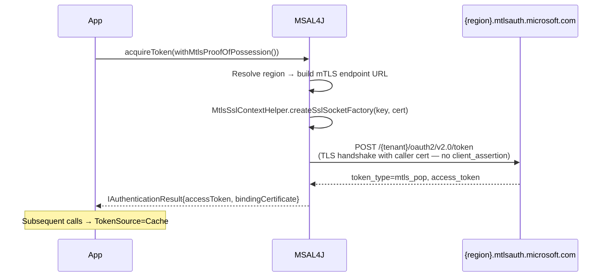
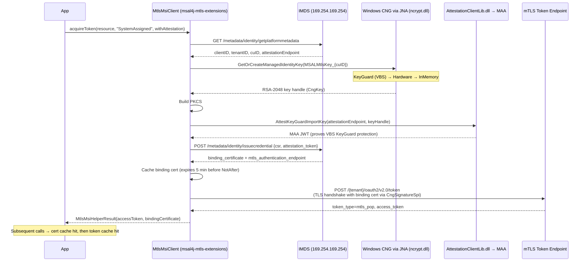

# mTLS PoP Architecture — Deep Dive

This document describes the internal architecture of the mTLS Proof of Possession implementation in MSAL4J. For the user-facing API guide, see [mtls-pop.md](mtls-pop.md).

---

## Flow Diagrams

### Path 1 — Confidential Client (SNI Certificate)



### Path 2 — Managed Identity (IMDSv2)



---

## 1. How Java Uses Windows CNG Without JNI Headers

Java has no built-in C FFI, but [JNA (Java Native Access)](https://github.com/java-native-access/jna) provides dynamic binding to native DLLs using pure Java interfaces — no C headers, no `javah`, no native compilation step beyond the DLL itself.

```java
// JNA interface — maps directly to ncrypt.dll exports
interface NCrypt extends Library {
    int NCryptOpenStorageProvider(PointerByReference phProvider, String pszProviderName, int dwFlags);
    int NCryptCreatePersistedKey(Pointer hProvider, PointerByReference phKey,
                                  String pszAlgId, String pszKeyName, int dwLegacyKeySpec, int dwFlags);
    int NCryptSetProperty(Pointer hObject, String pszProperty, byte[] pbInput, int cbInput, int dwFlags);
    int NCryptFinalizeKey(Pointer hKey, int dwFlags);
    int NCryptSignHash(Pointer hKey, Pointer pPaddingInfo, byte[] pbHashValue, int cbHashValue,
                       byte[] pbSignature, int cbSignature, PointerByReference pcbResult, int dwFlags);
}
```

The key flag that enables KeyGuard VBS isolation:
```java
private static final int NCRYPT_VBS_KEYISOLATION_FLAG = 0x00010000;
NCrypt.INSTANCE.NCryptFinalizeKey(hKey, NCRYPT_VBS_KEYISOLATION_FLAG);
```

This is the same flag used by msal-dotnet (via `CngKey`) and msal-go (via `syscall.NewLazyDLL`).

---

## 2. Custom `java.security.Provider` for CNG-Backed TLS

Java's JSSE TLS stack calls `java.security.Signature` for the TLS `CertificateVerify` handshake message. A standard Java `PrivateKey` from `SunMSCAPI` cannot wrap a CNG KeyGuard key handle.

The solution: a custom `java.security.Provider` (`CngProvider`) that registers `CngSignatureSpi` — a `Signature` implementation that delegates signing to `NCryptSignHash` via JNA, keeping the key handle inside the VBS enclave.

```
JSSE TLS handshake
  └─► KeyManager.getPrivateKey()         → returns CngPrivateKey (opaque handle)
  └─► Signature.getInstance("SHA256withRSA", CngProvider)
  └─► CngSignatureSpi.engineInitSign(CngPrivateKey)
  └─► CngSignatureSpi.engineSign()
        └─► NCryptSignHash(hKey, BCRYPT_PKCS1_PADDING, hash, ...) via JNA
              └─► ncrypt.dll (in-process, VBS KeyGuard boundary)
```

`engineInitVerify` throws `InvalidKeyException` intentionally — this causes JSSE's provider selection to fall through to `SunRsaSign`, which handles server certificate verification correctly. `CngSignatureSpi` only intercepts signing operations with the KeyGuard key.

---

## 3. Certificate Caching

The binding certificate (issued by `managedidentitysnissuer.login.microsoft.com`) is cached in-memory with a 5-minute pre-expiry buffer:

```
certCache key: cuID (compute unit ID from IMDS platform metadata)
certCache value: {bindingCert, expiry = cert.NotAfter - 5min}
```

The CNG key is persisted in the Microsoft Software Key Storage Provider under the name `MSALMtlsKey_{cuID}` (user scope). On subsequent calls, the key is opened with `NCryptOpenKey` rather than re-created, ensuring the same public key is presented in the CSR and that the cached binding certificate remains valid.

---

## 4. Cross-SDK Architecture Comparison

| Concern | msal-java | msal-dotnet | msal-go | msal-node |
|---------|-----------|-------------|---------|-----------|
| CNG key creation | JNA → `ncrypt.dll` | `CngKey` (.NET) | `syscall.NewLazyDLL` | Subprocess (exe) |
| TLS with CNG key | `CngSignatureSpi` + JSSE | Schannel (`NCRYPT_KEY_HANDLE`) | `crypto.Signer` interface | .NET subprocess |
| CSR generation | `Pkcs10Builder` (pure Java ASN.1) | `CertificateRequest` (.NET) | `encoding/asn1` (Go stdlib) | Subprocess |
| Attestation | JNA → `AttestationClientLib.dll` | Native NuGet package | `syscall` → DLL | Subprocess |
| In-process | ✅ | ✅ | ✅ | ❌ |
| .NET required | ❌ | ✅ (runtime) | ❌ | ✅ (subprocess) |

---

## 5. Why Path 1 Does Not Need JNA

Path 1 (SNI / Confidential Client) uses a certificate the caller already owns — typically loaded from a PKCS12 file or PKCS11 hardware token. Java's standard `KeyManagerFactory` and JSSE handle this transparently. The custom `SSLSocketFactory` built by `MtlsSslContextHelper` sets up the client certificate for the TLS handshake — no CNG involved.

---

## 6. Key Source Names

| Key Source | Description |
|------------|-------------|
| `KeyGuard` | Full VBS isolation — requires Credential Guard running |
| `Hardware` | TPM-backed but not VBS-isolated |
| `InMemory` | Software key — no hardware protection |

For production use, `KeyGuard` is required (`xms_tbflags: 2` in the token). `Hardware` or `InMemory` keys will result in `AADSTS392196` or similar errors from AAD.

---

## References

- [mTLS PoP API Guide](mtls-pop.md)
- [mTLS PoP Manual Testing](mtls-pop-manual-testing.md)
- [RFC 8705 — OAuth 2.0 Mutual-TLS Client Authentication](https://www.rfc-editor.org/rfc/rfc8705)
- [JNA (Java Native Access)](https://github.com/java-native-access/jna)
- [NCrypt API (MSDN)](https://docs.microsoft.com/en-us/windows/win32/api/ncrypt/)
